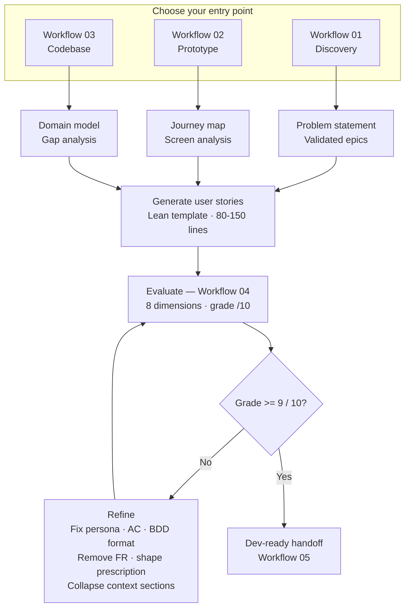

# Framework Overview

## The Problem With Traditional Backlog Creation

Traditional backlog creation has a handoff problem. Discovery happens in one room, story writing happens in another, and by the time engineering sees the ticket, critical context has been lost. The result: stories that need clarification, sprints that stall, and PMs stuck in meetings that should have been a comment.

AI doesn't fix this by itself. But used correctly, it compresses the gap between discovery and delivery — if you have the right workflow.

---

## How This Framework Works

The AI Backlog Generator framework is organized around five stages:

```
Discovery → Validation → Generation → Evaluation → Handoff
```

Each stage has its own workflow, prompts, and quality gates. You don't have to use all five — start where you have the most friction.

---

## Workflow Diagram



---

## Stage 1: Discovery

**Goal:** Extract structured product intent from raw input.

Raw input can be:
- A meeting transcript
- A product brief
- A set of wireframes
- An existing codebase
- A competitor analysis
- A support ticket cluster

AI transforms raw input into structured output: problem statement, user segments, job-to-be-done, constraints, and success metrics.

**Key document:** [Discovery → Backlog Workflow](../workflows/01-discovery-to-backlog.md)

---

## Stage 2: Validation (Fast Feedback Loop)

**Goal:** Confirm assumptions before investing in story writing.

This is the most skipped and most valuable stage. Before writing a single user story, validate:
- Is the problem real?
- Is the solution direction right?
- Are there hidden constraints from the codebase or architecture?
- Do stakeholders agree on scope?

AI accelerates this by generating validation questions, identifying assumption gaps, and surfacing risks from the codebase.

**Key document:** [Fast Feedback Loop](../docs/fast-feedback-loop.md)

---

## Stage 3: Generation

**Goal:** Produce structured epics, stories, and acceptance criteria.

With validated context, AI generates:
- Epics with clear business goals
- User stories in the right granularity
- Acceptance criteria that are testable and complete
- Edge cases that are often missed

The key is feeding AI the right context — not just "build a login page" but the business goal, user segment, technical constraints, and definition of done.

**Key documents:**
- [Generate Epics Prompt](../prompts/generate-epics.md)
- [Generate User Stories Prompt](../prompts/generate-user-stories.md)
- [Generate Acceptance Criteria Prompt](../prompts/generate-acceptance-criteria.md)

---

## Stage 4: Evaluation

**Goal:** Ensure every story meets the quality bar before it enters a sprint.

AI evaluates stories against a quality rubric:
- Is the user and their goal clear?
- Is the business value explicit?
- Are acceptance criteria testable?
- Is the story the right size?
- Are edge cases covered?
- Could an engineer build this without a follow-up?

**Key documents:**
- [Story Evaluation Workflow](../workflows/04-story-evaluation.md)
- [Backlog Quality Criteria](../docs/backlog-quality-criteria.md)
- [Evaluate Story Quality Prompt](../prompts/evaluate-story-quality.md)

---

## Stage 5: Handoff

**Goal:** Get to zero-ambiguity before sprint planning.

Dev-ready means:
- No open questions
- Dependencies identified
- Technical constraints documented
- Acceptance criteria cover happy path + edge cases
- Definition of Done is explicit

**Key document:** [Dev-Ready Handoff Workflow](../workflows/05-dev-ready-handoff.md)

---

## Choosing Your Entry Point

| Starting point | Go to |
|---|---|
| Discovery notes / product brief | [Workflow 01](../workflows/01-discovery-to-backlog.md) |
| Prototype or wireframes | [Workflow 02](../workflows/02-prototype-to-stories.md) |
| Existing codebase | [Workflow 03](../workflows/03-codebase-to-backlog.md) |
| Draft stories needing review | [Workflow 04](../workflows/04-story-evaluation.md) |
| Stories ready for sprint | [Workflow 05](../workflows/05-dev-ready-handoff.md) |

---

## Backlog Tracker

Generated stories can be exported to any backlog tool — Linear, Jira, GitHub Issues, or Shortcut. The framework produces markdown artifacts; how you import them depends on your team's tooling.