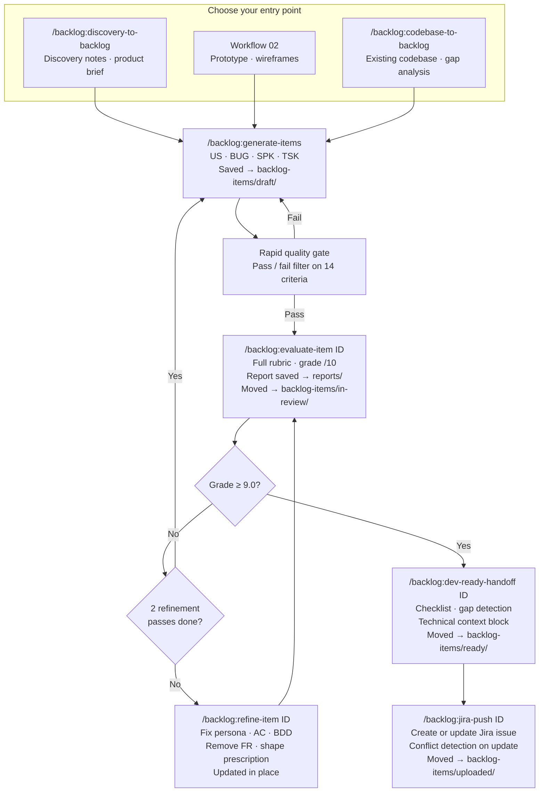

# Framework Overview

## The Problem With Traditional Backlog Creation

Traditional backlog creation has a handoff problem. Discovery happens in one room, story writing happens in another, and by the time engineering sees the ticket, critical context has been lost. The result: items that need clarification, sprints that stall, and PMs stuck in meetings that should have been a comment.

AI doesn't fix this by itself. But used correctly, it compresses the gap between discovery and delivery — if you have the right workflow.

---

## How This Framework Works

The AI Backlog Generator framework is organized around six stages:

```
Discovery → Validation → Generation → Evaluation → Handoff → Sync
```

Each stage has its own workflow, prompts, quality gates, and Claude Code skills. You don't have to use all six — start where you have the most friction.

---

## What Gets Generated

This framework produces four types of backlog items, each with its own template and quality rubric:

| Type | Prefix | Format |
|---|---|---|
| **Epic** | EP | 10-section format: Narrative, Strategic Context, Desired Transformation, Scope, Target Users, Functional Expectations, NFRs, Constraints, Dependencies, Success Metrics |
| **User Story** | US | In order to / As a / I want to / So that + Context + AC + BDD Scenarios + NFRs + Out of Scope |
| **Bug** | BUG | Summary + Steps to Reproduce + Expected vs. Actual + Severity + Fix AC + Out of Scope |
| **Spike** | SPK | Investigation Question + Context + Timebox + Expected Output + Definition of Done |
| **Task** | TSK | Description + AC + Dependencies + Out of Scope |

Every item is saved as a markdown file with a globally unique ID. Items move through status folders as they progress through the pipeline.

---

## Full Pipeline Diagram



---

## Stage 1: Discovery

**Goal:** Extract structured product intent from raw input and persist it for later sessions.

Raw input can be a meeting transcript, a product brief, wireframes, an existing codebase, a competitor analysis, or a support ticket cluster.

AI transforms raw input into structured output: problem statement, user segments, job-to-be-done, constraints, and success metrics. All discovery output — problem statement, domain model, gap analysis, broken processes, and suggested plan — is saved to `backlog/discovery/` so it can be reused in future story generation sessions without re-explaining context.

**Claude Code skill:** `/backlog:discovery-to-backlog` — guides through discovery questions, confirms the problem statement, saves a discovery record, generates and saves epics and backlog items with IDs.

**Claude Code skill:** `/backlog:codebase-to-backlog` — maps the domain model, identifies capability gaps, saves a discovery record with the full analysis, generates epics and items for high-priority gaps.

**Key document:** [Discovery → Backlog Workflow](../workflows/01-discovery-to-backlog.md)

---

## Stage 2: Validation (Fast Feedback Loop)

**Goal:** Confirm assumptions before investing in item writing.

This is the most skipped and most valuable stage. Before writing a single backlog item, validate:
- Is the problem real?
- Is the solution direction right?
- Are there hidden constraints from the codebase or architecture?
- Do stakeholders agree on scope?

AI accelerates this by generating validation questions, identifying assumption gaps, and surfacing risks from the codebase.

**Key document:** [Fast Feedback Loop](../docs/fast-feedback-loop.md)

---

## Stage 3: Generation

**Goal:** Produce structured epics and backlog items with IDs, saved to the local pipeline.

With validated context, AI generates items appropriate to the work type — user stories for new capabilities, bugs for defects, spikes for investigations, tasks for technical prerequisites. All items are saved to `backlog/backlog-items/draft/` with a globally unique ID and YAML frontmatter tracking their status and Jira key.

**Assumption gate:** After generating epics, every item marked `[To validate]` in Section 8 (Constraints and Assumptions) must be resolved before story generation begins. Stories written against unvalidated assumptions require rewrites when the answers surface — in sprint. The skills enforce this gate automatically.

**Team standards:** If `backlog/DoD.md` exists, story generation uses its **Required AC Coverage** and **Required NFR Standards** sections to shape the generated AC and NFRs. Run `/backlog:backlog-agent` and say "set up our Definition of Done" to configure it.

**Claude Code skills:**
- `/backlog:generate-epics` — epics saved to `backlog/epics/draft/`
- `/backlog:generate-items` — US, BUG, SPK, or TSK saved to `backlog/backlog-items/draft/`
- `/backlog:generate-ac` — adds AC and BDD to an existing item by ID
- `/backlog:generate-bdd` — adds BDD scenarios to an existing item by ID

**Key documents:**
- [Generate Epics Prompt](../prompts/generate-epics.md)
- [Generate User Stories Prompt](../prompts/generate-user-stories.md)
- [Generate Acceptance Criteria Prompt](../prompts/generate-acceptance-criteria.md)

---

## Stage 4: Evaluation

**Goal:** Ensure every item meets the quality bar before it enters a sprint.

Items are referenced by ID — no copy-pasting. The evaluation rubric varies by item type:

**User Stories** are scored on 8 dimensions (1–3 each, grade out of 10):
1. User Clarity
2. Business Value
3. Acceptance Criteria Quality
4. BDD Scenarios
5. Story Size
6. Edge Case Coverage
7. Dependency Clarity
8. Conciseness / NFRs / Out of Scope

Grade ≥ 9.0 = Dev-Ready · 7.0–8.9 = Needs Refinement · < 7.0 = Requires Rework

**Bugs** are evaluated on 6 pass/fail gates. **Spikes** on 4 gates. **Tasks** on 3 gates.

The evaluation report is saved to `backlog/reports/` and linked in the item's frontmatter. The item moves to `backlog/backlog-items/in-review/`.

**Claude Code skills:**
- `/backlog:evaluate-item {ID}` — full evaluation by ID or Jira link
- `/backlog:identify-edge-cases {ID}` — surfaces missing edge cases by category
- `/backlog:audit-items` — rapid 14-gate pass/fail across a full backlog

**Key documents:**
- [Story Evaluation Workflow](../workflows/04-story-evaluation.md)
- [Backlog Quality Criteria](../docs/backlog-quality-criteria.md)
- [Evaluate Story Quality Prompt](../prompts/evaluate-story-quality.md)

---

## Stage 5: Handoff

**Goal:** Get to zero-ambiguity before sprint planning.

Dev-ready means an engineer can pick up the item and start building without scheduling a meeting:
- No open questions
- Dependencies identified and linked
- Technical constraints documented
- AC covers happy path + error states + edge cases
- Delivery gates answered (tests expected, QA sign-off, analytics events, feature flags)

The **Delivery Gates** checklist is read from `backlog/DoD.md` if it exists, giving teams a consistent standard across all items. If the file does not exist, the skill uses built-in defaults.

The handoff report is saved to `backlog/reports/` and linked in the item's frontmatter. The item moves to `backlog/backlog-items/ready/`.

**Claude Code skills:**
- `/backlog:dev-ready-handoff {ID}` — checklist + gap detection + technical context block + kickoff note
- `/backlog:sprint-prep` — combined evaluation + handoff across a full sprint set
- `/backlog:refine-item {ID}` — targeted rewrite of items that need fixes (2-pass cap)
- `/backlog:split-item {ID}` — breaks oversized stories into sprint-sized items

**Key document:** [Dev-Ready Handoff Workflow](../workflows/05-dev-ready-handoff.md)

---

## Stage 6: Sync

**Goal:** Push dev-ready items to Jira, maintaining a single source of truth.

Once items reach `ready/` status, they are pushed to Jira via the REST API. The skill handles:
- **Create:** new Jira issue with summary, description (converted from markdown), and issue type
- **Update:** conflict detection compares Jira's last-modified timestamp against the local `jira_synced_at` field — asks before overwriting if someone edited the ticket after the last sync
- **Epic push:** automatically creates and links all `ready` child items under the epic in Jira

After a successful push, the `jira_key` and `jira_synced_at` are written into the item's frontmatter. The file moves to `backlog/backlog-items/uploaded/`.

Reference items by their local ID or Jira link in any subsequent skill:

```
/backlog:evaluate-item https://company.atlassian.net/browse/PROJ-42
```

**Claude Code skills:**
- `/backlog:jira-config` — set up connection, verify live API call
- `/backlog:jira-push {ID}` — create or update; `EP-001` pushes the epic and all linked ready children

---

## Choosing Your Entry Point

| Starting point | Claude Code skill | Manual workflow |
|---|---|---|
| Discovery notes / product brief | `/backlog:discovery-to-backlog` | [Workflow 01](../workflows/01-discovery-to-backlog.md) |
| Prototype or wireframes | `/backlog:generate-items` after screen analysis | [Workflow 02](../workflows/02-prototype-to-stories.md) |
| Existing codebase | `/backlog:codebase-to-backlog` | [Workflow 03](../workflows/03-codebase-to-backlog.md) |
| Items needing review | `/backlog:audit-items` or `/backlog:evaluate-item {ID}` | [Workflow 04](../workflows/04-story-evaluation.md) |
| Items ready for sprint | `/backlog:sprint-prep` | [Workflow 05](../workflows/05-dev-ready-handoff.md) |
| Items ready for Jira | `/backlog:jira-push {ID}` | — |

---

## The Local File Pipeline

All items are tracked in `backlog/counter.json` — a global registry that maps every ID to its current file path, status, type, title, and Jira key.

```
backlog/
├── discovery/        ← problem statements, gap analyses, domain models, plans
├── epics/
│   ├── draft/        ← generate-epics writes here
│   └── ready/        ← dev-ready-handoff moves epics here
├── backlog-items/
│   ├── draft/        ← generate-items writes here
│   ├── in-review/    ← evaluate-item moves items here
│   ├── refined/      ← optional manual staging
│   ├── ready/        ← dev-ready-handoff moves items here
│   └── uploaded/     ← jira-push moves items after sync
├── reports/          ← evaluation and handoff reports
└── DoD.md            ← team Definition of Done (AC coverage, NFR standards, delivery gates)
```

Every item file uses YAML frontmatter to track its lifecycle:

```yaml
---
id: US-003
type: Story
title: "Manager approves a PO suggestion"
status: ready
epic: EP-001
jira_key: PROJ-42
jira_synced_at: 2026-05-01T14:32:00Z
reports:
  evaluation: backlog/reports/US-003-eval-2026-05-01.md
  handoff: backlog/reports/US-003-handoff-2026-05-01.md
---
```

Report links are local only and never sent to Jira.

---

## Using Claude Code Skills vs. Manual Prompts

Both modes are supported and produce the same quality output.

| Mode | Best for | How to use |
|---|---|---|
| **Claude Code skills** | Teams working inside a repository, referencing items by ID, pushing to Jira | `.claude/commands/backlog/` — invoke with `/backlog:{skill}` |
| **Manual prompts** | One-off generation, teams not using Claude Code, any AI tool | `prompts/` folder — copy into any AI chat |
| **Conversational agent** | Exploratory work, mixed tasks in one session | Load `agent.md` into Claude Projects, ChatGPT, or Cursor |

See [Claude Code Skills](../docs/claude-code-skills.md) for the full skill reference.
